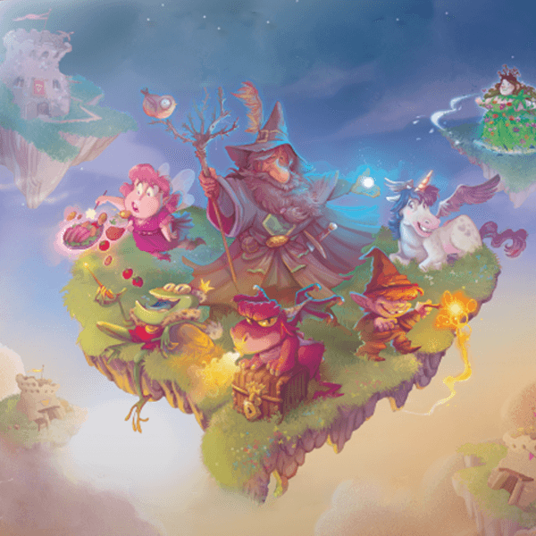

# ERYANTIS - Software Engineering Final Project 2021/2022
The project consists of a Java implementation of the board game Eryantis, made by Cranio Creations.

## GroupID: GC31
+ Francesco Palumbo
+ Matteo Pancini
+ Luigi Pascali
  
**Teacher**: Gianpaolo Cugola

## Implemented Functionalities
| Functionality                | Implementation |
|:-----------------------------|:--------------:|
| Basic rules                  |       ✅        |
| Complete rules               |       ✅        |
| Socket                       |       ✅        |
| CLI                          |       ✅        |
| GUI                          |       ✅        |
| Multiple games               |       ✅        |
| 4 players game mode          |       ✅        |
| 12 characters implementation |       ✅        |
| Persistence                  |       ⛔        |
| Disconnection resilience     |       ⛔        |

## Test cases coverage
**Coverage criteria: Code Lines**

All classes (from both Model and Controller's Packages) have 100% of class coverage.

| Package    | Tested Class       |   Coverage    |
|:-----------|:-------------------|:-------------:|
| Controller | Controller         | 146/154 (94%) |
| Controller | TurnController     | 317/389 (81%) |
| Controller | ExpertController   | 131/145 (90%) |
| Model      | Model Package      | 496/533 (94%) |

## Run jar information
In order to play the game file, download the JAR file from "deliverables" folder.
Then run it from **terminal** (from the directory where you save it) by typing:
>*java -jar softeng-GC31.jar*

For the best game experience we suggest:
+ CLI:
  + enable ANSI 
  + enable UTF-8
+ GUI:
  + if your computer has small memory size or "Load Exception - Java Heap Size" occurs, run the JAR file by typing:
    >*java -Xmx4096m -jar softeng-GC31.jar*